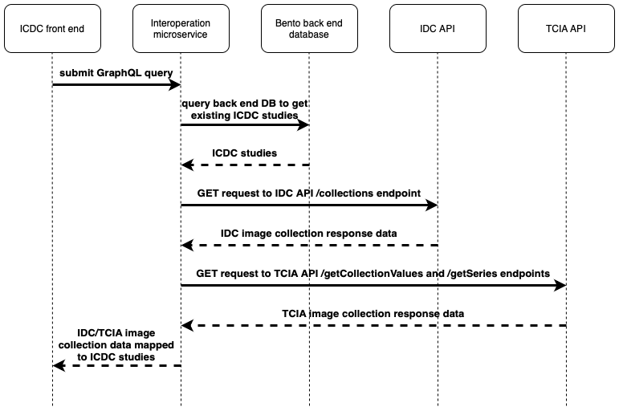

# crdc-ctdc-interoperation

This microservice supports interoperability between the CTDC and other nodes in the CRDC via publicly-available APIs. It identifies CTDC-relevant data in the CRDC nodes, maps the data to corresponding CTDC studies and provides an API for the CTDC front-end to retrieve information about the available data, including how to access it. Currently, the microservice searches for and returns relevant image collection data from the IDC and TCIA CRDC nodes; however, with minor updates, the number of CRDC nodes examined can easily be expanded as the need arises.

&nbsp;

## Interoperation process overview



&nbsp;

## Data available from CRDC nodes

| CRDC Node |                                                    Response data fields                                                    |
| :-------: | :------------------------------------------------------------------------------------------------------------------------: |
|    IDC    | collection_id, cancer_type, date_updated, description, doi, image_types, location, species, subject_count, supporting_data |
|   TCIA    |                Collection, total_patientIDs, unique_modalities, unique_bodypartsExamined, total_imageCounts                |

&nbsp;

## Usage

### Example query:

```
{
    getAllStudies {
        study_id
        study_short_name
        associated_links {
            associated_link_name,
            associated_link_url,
            metadata {
                
                ... on IDCMetadata {
                    collection_id,
                    cancer_type,
                    date_updated,
                    description,
                    doi,
                    image_types,
                    location,
                    species,
                    subject_count,
                    supporting_data
                }
                ... on TCIAMetadata {
                    Collection,
                    Aggregate_PatientID,
                    Aggregate_Modality,
                    Aggregate_BodyPartExamined,
                    Aggregate_ImageCount,
                    Aggregate_ImageBool
                }
            }
        },
       image_collection_count
    }
}
```

&nbsp;

### Example response:

```
{
    "data": {
        "getAllStudies": [
            {
                "study_id": "NCT04314401",
                "study_short_name": "CMB",
                "associated_links": [
                    {
                        "associated_link_name": "IDC",
                        "associated_link_url": "https://portal.imaging.datacommons.cancer.gov/explore/filters/?collection_id=cmb_ov",
                        "metadata": {
                            "collection_id": "cmb_ov",
                            "cancer_type": "Ovarian Cancer",
                            "date_updated": "2024-11-26",
                            "description": "The Cancer Moonshot Biobank [https://moonshotbiobank.cancer.gov/] is a National Cancer Institute initiative to support current and future investigations into drug resistance and sensitivity and other NCI-sponsored cancer research initiatives, with an aim of improving researchers'' understanding of cancer and how to intervene in cancer initiation and progression. During the course of this study, biospecimens (blood and tissue removed during medical procedures) and associated data will be collected longitudinally from at least 1000 patients across at least 10 cancer types, who represent the demographic diversity of the U.S. and receiving standard of care cancer treatment [https://www.cancer.gov/publications/dictionaries/cancer-terms/def/standard-of-care] at multiple NCI Community Oncology Research Program (NCORP) [https://ncorp.cancer.gov/] sites.\n\nThis collection contains de-identified histopathology imaging procured from subjects in NCI’s Cancer Moonshot Biobank-Ovarian Carcinoma Cancer (CMB-OV) cohort. Associated genomic, phenotypic and clinical data will be hosted by The Database of Genotypes and Phenotypes (dbGaP) [https://www.ncbi.nlm.nih.gov/gap/] and other NCI databases.\n\n13993796\n\nPlease see the CMB-OV: DICOM converted Slide Microscopy images for the Cancer Moonshot Biobank initiative Ovarian Cancer collection page to learn more about the pathology images and to obtain any supporting metadata for this collection.\n\n",
                            "doi": "10.5281/zenodo.13993796",
                            "image_types": "SM",
                            "location": "Ovary",
                            "species": "Human",
                            "subject_count": 14,
                            "supporting_data": "Clinical"
                        }
                    },
                    {
                        "url": "https://nbia.cancerimagingarchive.net/nbia-search/?MinNumberOfStudiesCriteria=1&CollectionCriteria=CTDC",
                        "repository": "TCIA",
                        "metadata": {
                            "Collection": "CTDC",
                            "total_patient_IDs": 57,
                            "unique_modalities": [
                                "MR"
                            ],
                            "unique_bodyparts_examined": [
                                "HEAD"
                            ],
                            "total_image_counts": 17797
                        }
                    }
                ],
               "image_collection_count": 12
            }
        ]
    }
}
```

&nbsp;

## Environment variables

    - BENTO_BACKEND_GRAPHQL_URI: Bento backend URI for GraphQL POST requests
    - REDIS_HOST: Redis cache host
    - REDIS_PORT: Redis cache port
